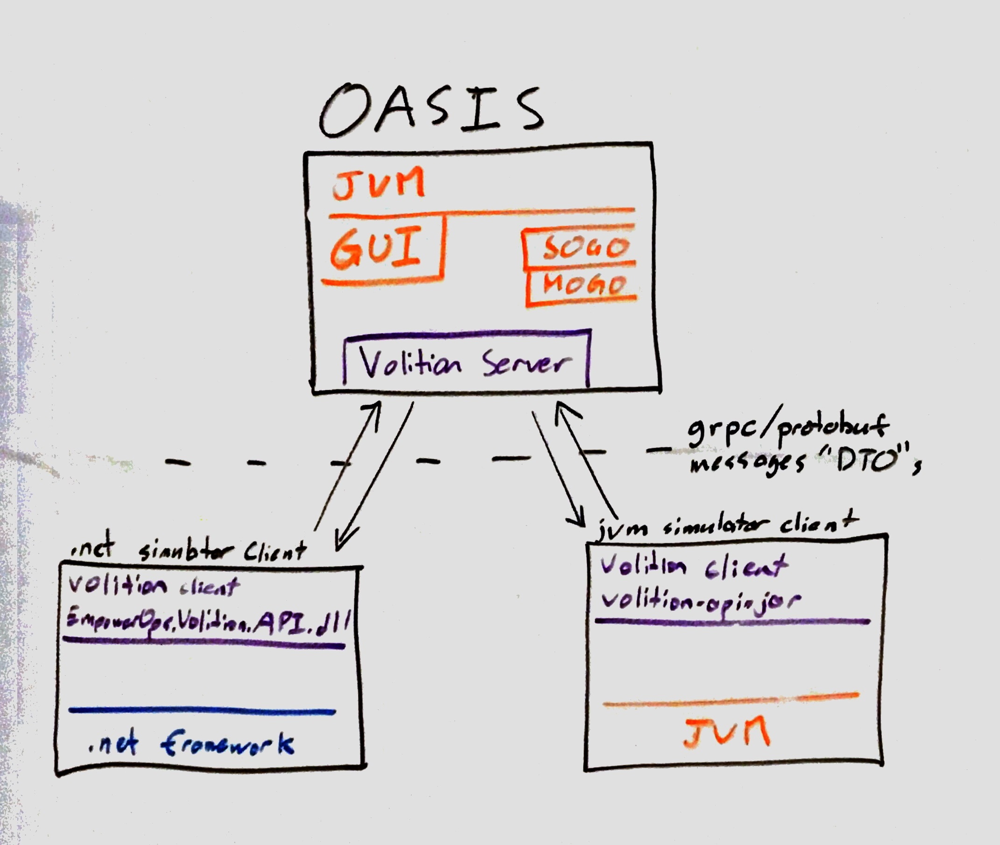
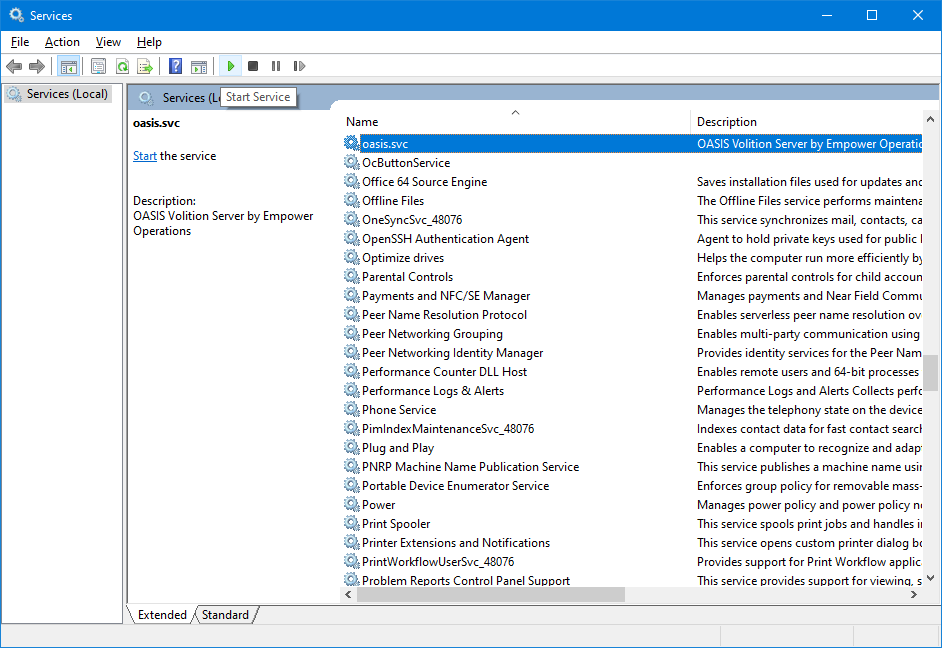

Necessary components for building a plugin with the Empower Operations Volition API for optimization

This API is a service API; it defines protobuf messages for use with a GRPC protocol and endpoint.

## How to use this repository ##

This repository contains enough code to get you started on building a simulator plugin for OASIS with a java, .net, or cpp application. You should be able to look at the implementations here and build your component similar to the reference simulator implementation. To run the reference implementations involves either downloading them or building them from source.

To use the volition API, two components must be run: 
1. a volition-compatible optimizer server. OASIS 2021 is a volition compatible server. Alternatively, a reference optimizer server is also included in this repository
2. a volition-compatible simulator client (aka 'the plugin'). This is the component you are _probably_ building.   

> the word 'plugin' is nebulous because the a volition plugin is also a plugin to some kind of FEA or CFD simulator. Thus, we avoid the phrase 'plugin' below in favour of the phrase 'simulator client'.

The Volition API is rooted in the `optimizer.grpc` document that is used to generate Python, C#, Java and cross-platform C++ code for use in the Python, .net, jvm, and llvm/gcc/mscrt runtime environments respectively. This means that to build a component against this API from source, the following steps must be performed:

1. use `optimizer.grpc` to generate the appropriate language code (C# for .net, java for jvm, etc) 
2. download and assemble the runtime dependencies of that generate code (namely, `protobuf.dll/.jar`, `grpc.dll/.jar`, etc)
3. compile the generated code to an output binary (`EmpowerOps.Volition.Api.dll` or `volition-api.jar`)
4. add that output binary to be a dependency of the plugin you wish to build
5. compile your simulator client to a runnable form (eg `csharp-client-reference` to `EmpowerOps.Volition.RefClient.exe` in `csharp-client-reference\bin\Debug`)
   
Tools involved:
- Visual Studio 2019
- The Java Development kit
- gradle
- grpc

To start building a simulator client to OASIS you will want to refer to one of the following clients 

type | language-env | Folder | Artifact 
--- | --- | --- | --- 
api | any C++ | **TBD** | **TBD**
api | .net | `/api/build/dotnet-bin` | `EmpowerOps.Volition.Api.dll`
api | jvm | `/api/build/libs` | `volition-api-0.1.jar`
api | python | `/api` **TBD** | **TBD** `optimizer-reference.pylib`
ref-client | .net | `/chsarp-reference-client` | `EmpowerOps.Volition.RefClient.zip`
ref-oasis | jvm | `/oasis-reference` | `oasis-reference.zip`

Regardless of which client-simulator you use, all clients use the `oasis-reference` _java_ server. So, to connect to a running optimization without having a live copy of OASIS running, you must run the reference-oasis java server

> OASIS 2018 and 2020 do not start a volition API server. To connect to a live copy of OASIS, 
you must use a copy of OASIS 2021.  

You can download a copy of prebuilt reference binaries from the [releases](https://github.com/EmpowerOperations/volition/releases) page, or you can find steps further below to build them yourself.

**TBD: links to published nuget/maven/pip packages**

## Running Volition ##

Please take a look at the [Releases](https://github.com/EmpowerOperations/volition/releases) for reference binaries. You can also see the steps below to build the reference binaries. 

### Running an optimization with the reference client ###

Once you have run the reference simulator client and reference optimizer server you should see two windows: 

From here you can use the "inputs" table to add and remove variables, the "outputs" table to add and remove objectives. 
You can also configure their input bounds in the table.

This should be similar in principal to the simulation client that you wish to build.   

To start the optimization loop:

1. in the reference client (CANSYS):

   1. add two inputs, name them "x1" and "x2"
   2. add an output "f1"
   3. add optimization metadata:
      > with OASIS 2019, you can leave all configuration of the metadata to the OASIS UI. Alternatively you can write your simulator to collect this information to the user.
      1. change x1's lower and upper bound to 0 and 10
      2. change x2's lower and upper bound to 10 and 20
   4. click "Start Optimization"

> Note that the reference optimizer is a random search, and is thus does not perform well. Using OASIS 2021 will yield different results.

You should see something similar to below.

This demonstrates the reference client and reference optimizer performing an optimization of the reference simulator client over the volution API for two variables and one objective. 

### Running an optimization with OASIS ###

_Please note that volition is not supported in OASIS until OASIS 2021_

Running an Optimization with OASIS instead of the reference optimizer is very similar. Once you have installed OASIS 2021, open up the microsoft Services app, find oasis.svc, and click "start service".
Once thats complete, follow the same steps as you would if an optimization was running.

## Build the Volition API ## 

To build the API binaries yourself you will need to run the gradle build scripts, and the compile the generated source code with your own tools as appropriate. 

1. run `gradlew assemble`

   This will generate C# and Java code in `api\build\generated\source\proto\main`
  
   It will also compile the java code to generate `volition-api-0.1.jar` in `api\build\libs. This will be used by the optimizer-server.
   
   > unfortunately this step will not generate `EmpowerOps.Volition.API.dll` because of a technical limitation of gradle: It currently does not support C#. Thus we must manually open visual studio to generate it ourselves.   
   
2. To build the C# app with visual studio: run _Visual Studio_, open `volition.sln`,   

   Note this solution contains both the simulator-client "ClientRef" and Volition API "Api" projects. 
   
3. Build `EmpowerOps.Volition.Api`

   this will generate the `EmpowerOps.Volitiion.API.dll` .net assembly in `api\build\dotnet-bin\`. The other files in that folder are windows and linux runtime dependencies. These will be used by the simulator-client. 

### Building the C# reference client ###

Once you have the API binaries built you can build and run a reference simulator client

1. run _Visual Studio_, open `volition.sln`

2. Build `EmpowerOps.Volition.ClientRef`

   this will generate a runnable executable `EmpowerOps.Volition.RefClient.exe` in `csharp-client-reference\bin\Debug`

### Building the cpp reference client ###

The cpp reference client is a CLI based one-shot optimization client. The purpose of the client is to show how you can use grpc to generate cpp source code and link that code to your project.

0. open a shell to the root of the repository
1. run `.\gradlew.bat vcpkgInstall` to download grpc and all its dependencies through vcpkg
2. run `.\vcpkg\vcpkg.exe integrate install "--feature-flags=manifests,versions"` to cause vcpkg to update visual studio INCLUDE directories to contain grpc lib files.
3. run _Visual studio 2019_, open `volition.sln`
4. from within visual studio, select `cpp-client-reference` as the startup project, and select `run`. 

### Building the java/kotlin reference optimizer ###

Once you have the API binaries built you can also build and run the reference optimizer server:

1. run `gradlew assemble`

   this will generate `oasis-reference-0.1.jar` in `oasis-reference\build\libs`

2. run `oasis-reference/ref-opt.exe`, which will in turn load and run the newly reference optimizer

---

From here, if you need any help please contact [support@empowerops.com](mailto:support@empowerops.com)

---
