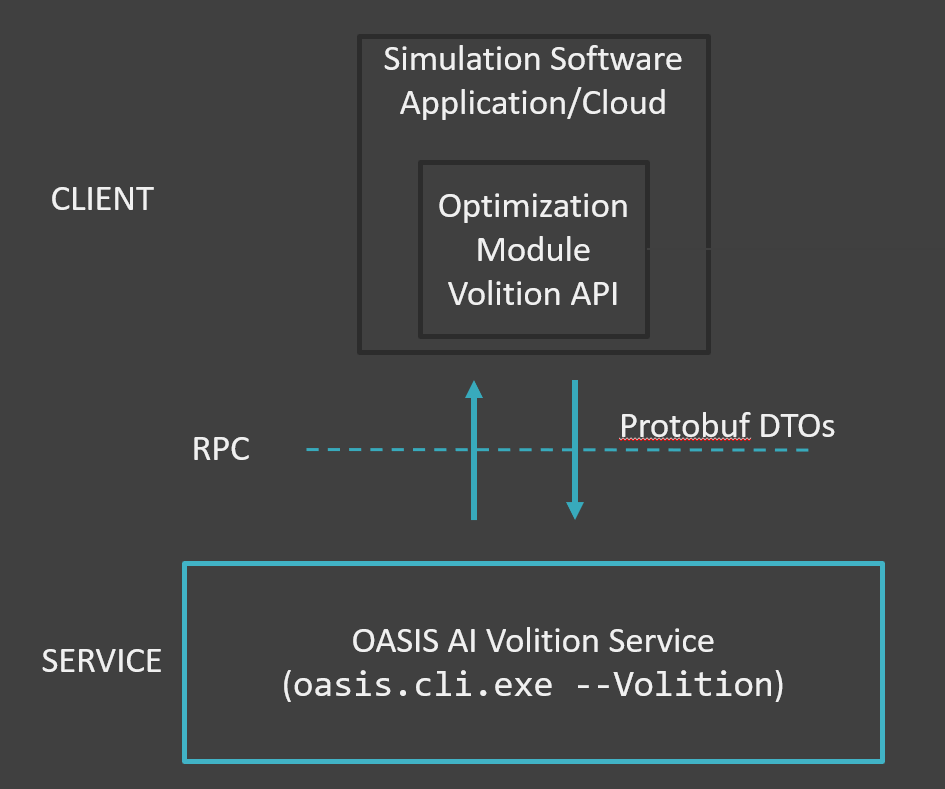

Necessary components for building a plugin with the Empower Operations Volition API for optimization

This API is a service API; it defines protobuf messages for use with a GRPC protocol and endpoint.

Note that Volition defines the API and protocol, there are two service-side implementations of Volition, OASIS and the Volition Reference Optimizer. 

## How to use this repository ##

This repository contains enough code to get you started on building a simulator plugin for OASIS with a java, .net, or cpp application. You should be able to look at the implementations here and build your component similar to the reference simulator implementation. To run the reference implementations involves either downloading them or building them from source.

To use the volition API, two components must be run: 
1. a volition-compatible optimizer server. OASIS 2022 is a volition compatible server. Alternatively, a reference optimizer server is also included in this repository
2. a volition-compatible simulator client (aka 'the plugin'). This is the component you are _probably_ building.   

> the word 'plugin' is nebulous because the volition plugin is also a plugin to some kind of FEA or CFD simulator. Thus, we avoid the phrase 'plugin' below in favour of the phrase 'simulator client'.

## Volition Implementation Overview

A Running volition optimization involves two running programs: A Volition Optimization Server (typically OASIS), and a Volition Simulation Client. These two programs communicate via the GRPC protocol using Protobuf messages.

The GRPC functions are used in three stages:

1. **Problem Definition**
   - Inputs and lower/upper bounds
   - Constraints
   - Objectives (minimize, maximize)
   - Run Settings - Budget
   - call Start Optimization (`StartOptimization`)

2. **Execute iterations**
   - read input values
   - running the simulation
   - returning simulation outputs (`OfferSimulationResult` or `offerErrorResult`)
   

3. **Post processing**
   - retrieve optimization summary data (`RequestRunResults`)
   - convergence plot
   - result sheet

## Getting Started: Using the API from your environment ##

The general flow for all languages is that you need to get the GRPC volition protoc code, link it to your project, and compile your code.

For dotnet and java you can grab prebuild binaries from the [releases](https://github.com/EmpowerOperations/volition/releases) page, or you can find steps further below to build them yourself.

> Prebuilt binaries are not available for c++. You must generate the cpp and compile it locally.

### Please see [getting-started.md](getting-started.md) for more details. ###

## Running Volition ##

Please take a look at the [Releases](https://github.com/EmpowerOperations/volition/releases) for reference binaries. You can also see the steps below to build the reference binaries. 

### Running an optimization with the reference client ###

Once you have run the reference simulator client and reference optimizer server you should see two windows: 

From here you can use the "inputs" table to add and remove variables, the "outputs" table to add and remove objectives. 
You can also configure their input bounds in the table.

This should be similar in principal to the simulation client that you wish to build.   

To start the optimization loop:

1. in the reference client (CANSYS):

   1. add two inputs, name them "x1" and "x2"
   2. add an output "f1"
   3. add optimization metadata:
      > with OASIS 2019, you can leave all configuration of the metadata to the OASIS UI. Alternatively you can write your simulator to collect this information to the user.
      1. change x1's lower and upper bound to 0 and 10
      2. change x2's lower and upper bound to 10 and 20
   4. click "Start Optimization"

> Note that the reference optimizer is a random search, and is thus does not perform well. Using OASIS 2022 will yield different results.

You should see something similar to below.

This demonstrates the reference client and reference optimizer performing an optimization of the reference simulator client over the volution API for two variables and one objective. 

### Building & debugging optimization with OASIS ###

While building and debugging the application we recommend either using the reference optimizer or using `oasis.cli.exe`. Using `oasis.cli.exe --volition 5550` will run OASIS locally with debugging outputs on port 5550.

> Please note that volition is not supported in OASIS until OASIS 2022

### Running OASIS at deployment ### 

 Once you have installed OASIS 2022, open up the microsoft Services app, find oasis.svc, and click "start service".
Once thats complete, follow the same steps as you would if an optimization was running.

